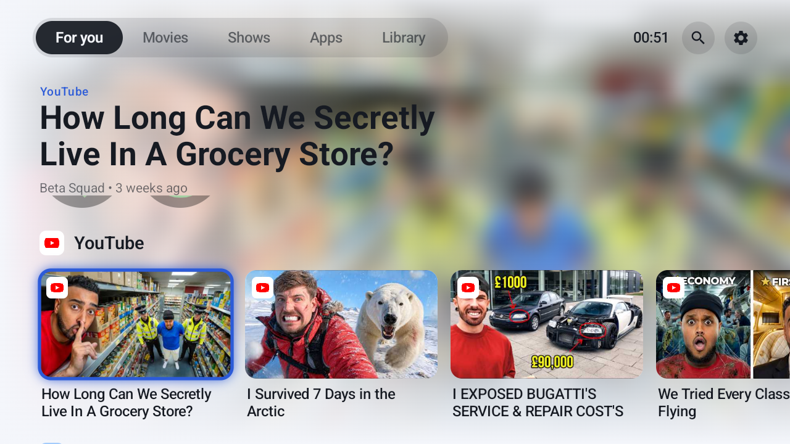
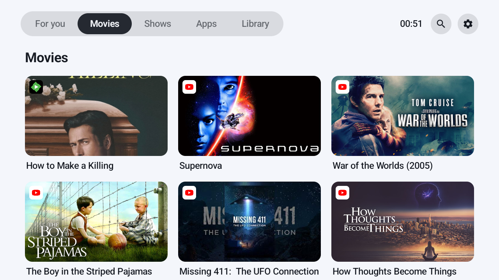
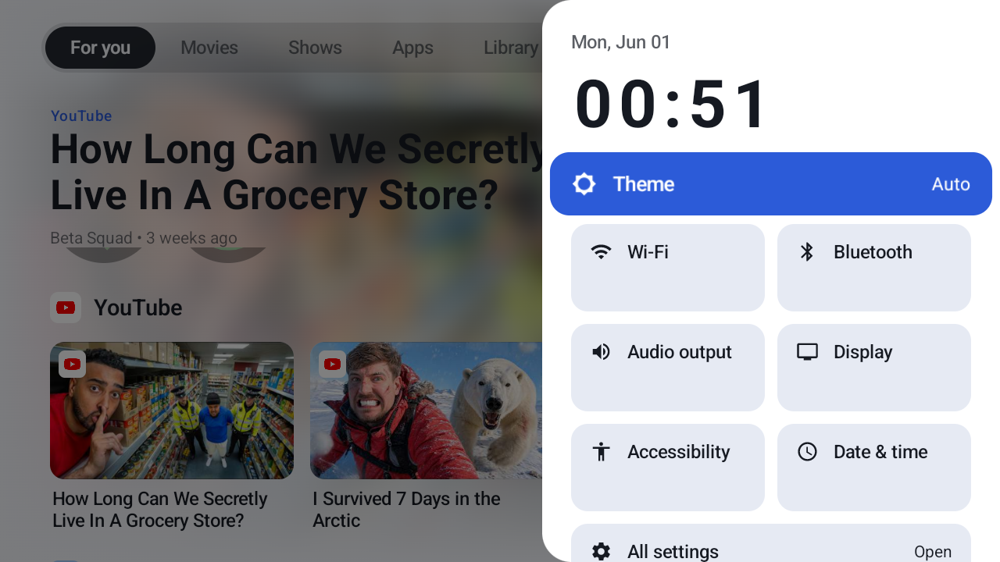
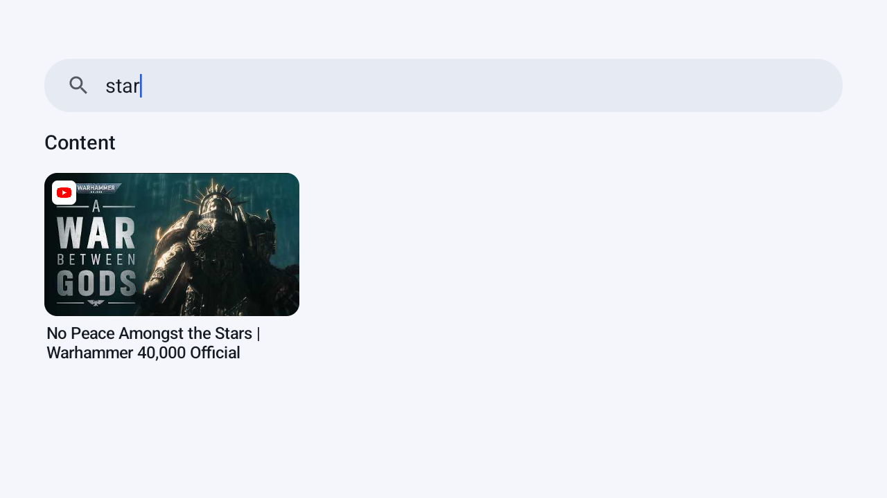

# Vista

A custom home-screen launcher for Android TV / Google TV, built because the stock Google TV
launcher is slow, ad-laden, and dark-only — which is miserable on a **projector in daylight**.
Vista is fast, adapts light/dark for the room, and surfaces your real content instead of sponsored rows.

Written in Kotlin with Jetpack Compose for TV. Targets API 34, runs on a 1 GB-RAM Google TV stick.



## Why it exists

The launcher that ships on these sticks pushes "sponsored" content and a fixed dark theme. On a
projector that washes out in daylight, the dark UI is unreadable. Vista was built to fix that
specific problem and grew into a full launcher:

- **Adaptive theme** — light & bright by day for projector readability, dark & cinematic at night.
- **Real content, no ads** — Continue Watching, per-app content rows, Movies/Shows, all from the
  apps you actually use.
- **No account, no telemetry** — it reads the device, nothing leaves it.

## Features

- **Tabs:** For you · Movies · Shows · Apps · Library, plus Search — an Apple-TV-style segmented
  control with an animated selector.
- **Immersive hero** that updates as you move focus, with a blurred backdrop, full (non-truncated)
  titles, descriptions, season/episode and time-left.
- **Continue Watching** and per-app content rows ("On YouTube", "On Prime Video", …) pulled from the
  TV provider — real posters with deep-link launch into the source app.
- **Fixed focus ring** — the ring stays pinned at the left while the row slides under it, and moves
  with the card once the row can't scroll further (Apple-/Google-TV behaviour).
- **Jump back in** from Vista's own launch history (no system usage-access dependency).
- **Favourites** — long-press an app to pin it.
- **Apps grid** including sideloaded apps the stock launcher hides.
- **Quick-settings dashboard** on the MENU / Settings button: theme toggle, Wi-Fi/Bluetooth/Display/
  Accessibility/Date deep-links, a MediaRouter **audio-output switcher**, and live notifications.
- **Notification overlays** over other apps while you're watching.
- **Search** with on-screen keyboard, live-filtering apps and content.

## Screenshots

| Home | Movies | Quick settings | Search |
|---|---|---|---|
|  |  |  |  |

## How it works (the interesting bit)

A few things a sideloaded launcher supposedly *can't* do, that Vista does:

- **Cross-app Continue Watching.** Reading other apps' published channels/programs requires
  `android.permission.READ_TV_LISTINGS`, which is `protectionLevel="dangerous"` — i.e. grantable with
  `pm grant`. Vista reads `TvContractCompat.WatchNextPrograms` and `PreviewPrograms` and renders real
  posters with the publisher's own `COLUMN_INTENT_URI` deep-link. The only thing genuinely locked is
  the system-aggregated watch-next table (`ACCESS_ALL_EPG_DATA`, signature/privileged), which we
  don't need — we read the per-app channels directly.
- **"Jump back in"** uses Vista's own launch history (a DataStore list), because Google TV withholds
  `UsageStatsManager` data from third-party launchers — queries come back empty even with the
  permission granted.
- **Quality app art** is loaded at `DENSITY_XXXHIGH` so icons stay crisp at large/circular sizes.

## Build

Prerequisites: **JDK 17**, the **Android SDK** (platform 34 + build-tools 34.0.0), and `adb`.

```bash
git clone https://github.com/kierandrewett/vista.git
cd vista
# point Gradle at your SDK (or set ANDROID_HOME)
echo "sdk.dir=$HOME/Android/Sdk" > local.properties
./gradlew :app:assembleRelease
```

Use the **release** build on-device — it's non-debuggable and dramatically smoother than debug on
low-RAM TV hardware. It's signed with the debug key so it installs without extra setup. The APK
lands at `app/build/outputs/apk/release/app-release.apk`. CI builds it on every push (see Actions).

## Install on a device

Enable **Wireless debugging** on the TV (Settings → System → Developer options), then:

```bash
adb connect <tv-ip>:<port>
adb install -r app/build/outputs/apk/release/app-release.apk
```

Vista works out of the box, but a few capabilities need permissions a launcher can't request at
runtime. Grant them once over adb:

```bash
P=dev.drewett.vista
# real Continue Watching / content rows
adb shell pm grant $P android.permission.READ_TV_LISTINGS
# notification overlays + quick-settings notifications
adb shell appops set $P SYSTEM_ALERT_WINDOW allow
adb shell cmd notification allow_listener $P/$P.service.VistaNotificationListenerService
# make Vista the home screen
adb shell cmd role add-role-holder android.app.role.HOME $P
```

Press **Home** and Vista takes over. To revert: `adb shell cmd role add-role-holder android.app.role.HOME <other-launcher>`.

## Architecture

Single module, `dev.drewett.vista`:

- `data/` — repositories: `AppRepository` (PackageManager/LauncherApps), `ChannelsRepository`
  (TvProvider), `UsageRepository` + `LaunchHistoryRepository`, `FavouritesRepository`,
  `SettingsRepository`, `AudioRepository` (MediaRouter), `AccountRepository`.
- `domain/` — immutable models (`AppEntry`, `ContentCard`, `HomeSection`, `Spotlight`).
- `ui/` — Compose for TV: `home/` (tab shell, immersive hero, rows), `content/` (grids, library,
  search), `quicksettings/`, `components/` (cards, focus handling).
- `service/` — `VistaNotificationListenerService` + the over-app overlay.

## Limitations (honest)

- The **aggregated** system "Watch Next" row is privileged; Vista builds its own from per-app
  channels, so coverage depends on which apps publish them.
- The **Google account avatar** isn't readable by a third-party app (account visibility is blocked
  since Android 8), so there's no avatar.
- **Audio-output switching** uses MediaRouter; on devices where the system only exposes the default
  route, only that route appears.
- adb-granted permissions are **per-device** — a clean install elsewhere falls back to deep-linking
  into system Settings.

## License

MIT — see [LICENSE](LICENSE).
